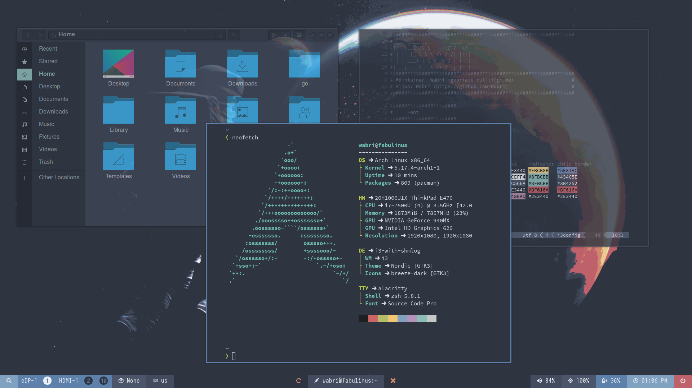
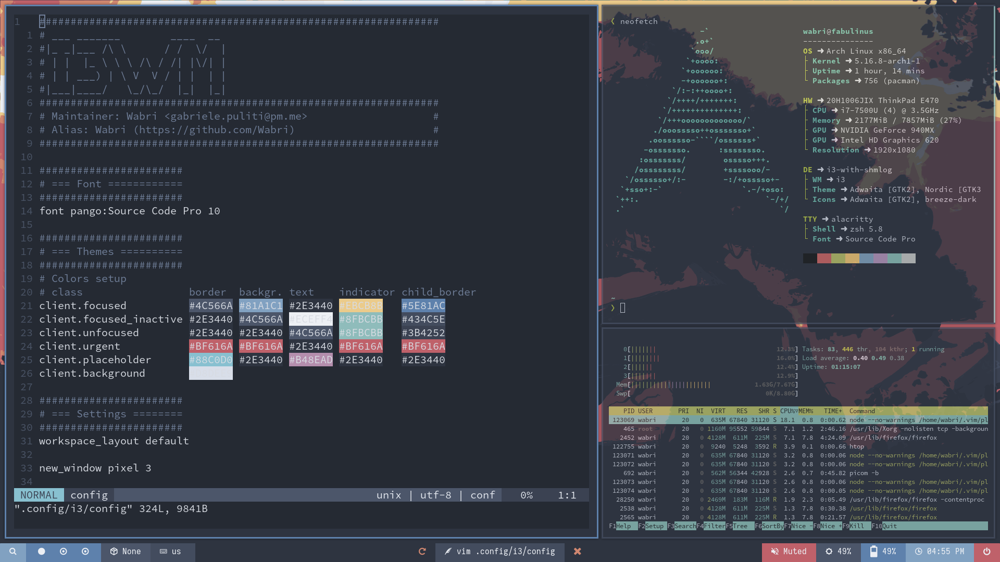

# Wabri's Dotfiles

***Forever work in progress***

Nautilus + Neofetch + vim:



Tmux+zsh+NeoVim+Vimwiki:



Spotify:


Wallpaper:


## About this config

* Focus on **shortcuts**
* High **usability** and **performance**
* **Optimized** for a 60% keyboard
* **Low resources** used
* **Colors and palette**: Mostly [Nord Theme](https://www.nordtheme.com/docs/colors-and-palettes)

## Table of contents

- [Why nord?](#why-nord)
- [How I maintain those dotfiles](#how-i-maintain-those-dotfiles)
- [How to install this dotfiles](#how-to-install-this-dotfiles)

## Why nord?

I'm using the [nord colorscheme](https://www.nordtheme.com/) because is a perfect balance between dark and light. Don't judge me I love dark themes, but there is something missing in using a total dark theme.
I remember when the first time I riced I spent over a month by changing the palette to find a list of colors that fits, thanks to [mycolor.space](https://mycolor.space/) that helped me a lot.
One day [one of my friend](https://github.com/w00zie) told me that he started using a colorscheme called nord and after some screenshot I decided to try it.
Now I'm using nord everywhere I can, from vim to firefox and I'm well settled.

## How I maintain those dotfiles

With [Daje](https://github.com/Wabri/Daje) of course.

## How to install this dotfiles

There are 3 dotfiles here and the definitions are stored in those profiles:

 - [ArchBTW](vars/os_Archlinux.yml)
 - [MacOSX](vars/os_MacOSX.yml)
 - [Fedora](vars/): TBD

Be sure to have python3, than follow this steps:

- Install [Poetry](https://python-poetry.org/) by follow the docs [here](https://python-poetry.org/docs/#installation).

    ```bash
    curl -sSL https://raw.githubusercontent.com/python-poetry/poetry/master/get-poetry.py | python -
    ``` 

- Clone the repository then cd into it:

    ```bash
    git clone https://github.com/Wabri/dotfiles
    cd dotfiles
    ```

- Run poetry install and run ansible-playbook, depending on the os the specific dotfiles will be installed:

    ```bash
    poetry install
    poetry run ansible-playbook -K install.yml 
    ```

Ansible install everything and once is done the system should work. In some cases (ArchBTW) a reboot is necessary.

