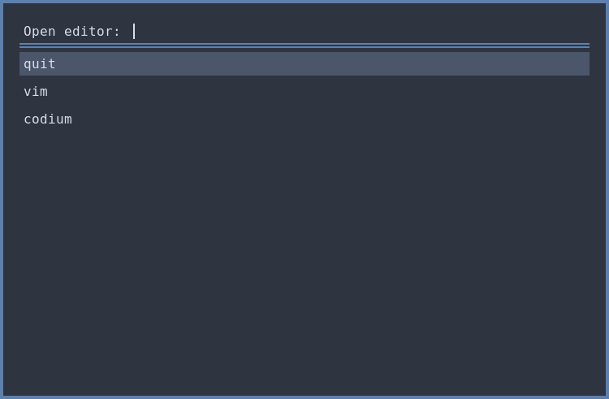
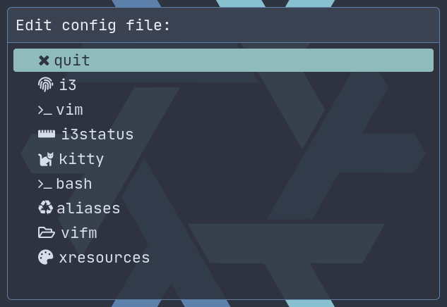

# Wabri's Dotfiles

A total nord dotfiles.

## Table of contents

- [Why nord?](#why-nord)
- [How I maintain those dotfiles](#how-i-maintain-those-dotfiles)
- [kitty](#kitty)
- [bash](#bash)
- [Scripts](#scripts)

## Why nord?

I'm using the [nord colorscheme](https://www.nordtheme.com/) because is a perfect balance between dark and light. Don't judge me I love dark themes, but there is something missing in using a total dark theme.
I remember when the first time I riced I spent over a month by changing the palette to find a list of colors that fits, thanks to [mycolor.space](https://mycolor.space/) that helped me a lot.
One day [one of my friend](https://github.com/w00zie) told me that he started using a colorscheme called nord and after some screenshot I decided to try it.
Now I'm using nord everywhere I can, from vim to telegram and I'm well settled.

## How I maintain those dotfiles

I created a .dotfiles directory on my home and init a bare repository on it:

```Bash
mkdir ~/.dotfiles
git init --bare ~/.dotfiles
```

I defined an alias:

```bash
alias dotfiles='git --git-dir=$HOME/.dotfiles --work-tree=$HOME'
```

I set the remote:

```Bash
dotfiles remote add origin git@github.com:Wabri/dotfiles.git
```

And now I can update my dotfiles wherever I am and whenever I want, by simply use the git command, example:

```Bash
dotfiles add .bashrc
dotfiles commit -m "Update (bashrc)"
dotfiles push 
```

Atlassian made a tutorial about this method, you can find the post here [**The best way to store your dotfiles: A bare Git repository**](https://www.atlassian.com/git/tutorials/dotfiles).

## Kitty

- [kitty.conf](.config/kitty/kitty.conf)
- [nord.conf](.config/kitty/nord.conf)

The page of the [kitty site](https://sw.kovidgoyal.net/kitty/) said: the fast, featureful, GPU based terminal emulator. Fast is fast for now, I confirm the featureful and I presume it use the GPU.

I love to use the [JetBrains](https://www.jetbrains.com/lp/mono/) font for the lignatures, the letters and the semplicity of the shapes:


I found useful the build-in tabs and windows feature:


Then I create some personal shortcuts using the alt as kitty modifier:

| --- | Description |
| - | - |
| ctrl+shift+c | copy |
| ctrl+shift+v | paste |
| kitty_mod+u | hints urls |
| kitty_mod+enter | new window |
| kitty_mod+r | resizing window |
| kitty_mod+] | move to next window |
| kitty_mod+[ | move to previous window |
| kitty_mod+k | move window to top |
| kitty_mod+t | new tab |
| kitty_mod+w | close tab |
| kitty_mod+i | set tab title |
| kitty_mod+l | next tab |
| kitty_mod+h | previous tab |
| kitty_mod+shift+L | move tab forward |
| kitty_mod+shift+H | move tab backward |
| kitty_mod+1 | go to tab 1 |
| kitty_mod+2 | go to tab 2 |
| kitty_mod+3 | go to tab 3 |
| kitty_mod+4 | go to tab 4 |
| kitty_mod+5 | go to tab 5 |
| kitty_mod+shift+E | edit config file |
| kitty_mod+shift+U | unicode input |

The nord palette of kitty can be found in the [same directory of the kitty config](.config/kitty/).

## Bash

- [.bashrc](.bashrc)
- [.bash_aliases](.bash_aliases)
- [wabri.theme.bash](.bash_it/themes/wabri/wabri.theme.bash)

I use [bash-it framework](https://github.com/Bash-it/bash-it) with some patches I made and one new theme created by me.

### Bashrc

Some mentions on this configuration:

* Vim motion abilitate:

    ```Bash
    set -o vi
    ```
    
* The must have ignore case abilitate:

    ```Bash
    bind 'set completion-ignore-case on'
    ```

* Some history settings and more (if you are curious there are many comments on the script)

### Bash aliases

Mine aliases are:

* Replace the old **ls,ll and la** with [exa](https://the.exa.website/):


* Created some **cd** aliases:


* Shortcuts for **apt**:


* Alias for [thefuck](https://github.com/nvbn/thefuck):


* Dotfiles command to update this repo ([How I maintain those dotfiles](#how-i-maintain-those-dotfiles)):


There are a lot of aliases that you can find also on the general aliases of [bash-it](https://github.com/Bash-it/bash-it).

## Scripts

Overtime I create a lot of scripts:

| Script | Description |
| ------ | ----------- |
| [chkey](#chkey) | Change keyboard layout |
| [code-editor](#code-editor) | Choose text editor to open |
| [dtest](#dtest) | Run tests for dunst notifications |
| [edit-config](#edit-config) | Choose what config need to edit |
| [extract](#extract) | Extract everything |
| [i3exit](#i3exit) | Systmctl for human |
| [i3light](#i3light) | Brightness controll for humans |
| [i3media](i3media) | Controll media with command line |
| [system-controll](#system-controll) | Systmctl menu |
| [vimv](#vimv) | Batch-rename files using Vim -- [thameera/vimv](https://github.com/thameera/vimv) |

### Chkey

***[.local/bin/chkey](.local/bin/chkey)***

The script switch over 2 keyboard Italian and Us, can work over more keyboard by adding a new use case.

The content of the case is this:

```Bash
setxkbmap -v | awk -F '+' '/symbols/ {print $2}'
```

from the output of the setxkbmap -v, that is something like this:

```Text
Trying to build keymap using the following components:
keycodes:   evdev+aliases(qwerty)
types:      complete
compat:     complete
symbols:    pc+us+inet(evdev)
geometry:   pc(pc105)
```

On the line where there is **symbols** split when find the + simbol and return the second component, in this case will be the keyboard layout. This result is passed for the cases and if the layout is us than switch to it and viceversa.


### Code-editor

***[.local/bin/code-editor](.local/bin/code-editor)***

This is one of the menu used with i3 (I binded with mod+f3):



### Dtest

***[.local/bin/dtest](.local/bin/dtest)***

Simply restart the dunst session, used to debug dunst configuration:


### Edit-config

***[.local/bin/edit-config](.local/bin/edit-config)***

Same functionality of [code-editor](#code-editor), but choose from configurations.



### Extract

***[.local/bin/extract](.local/bin/extract)***

For now works with:

- tar.bz2
- tar.gz 
- bz2
- rar
- gz
- tar
- tbz2
- tgz
- zip
- Z
- 7z


### i3exit

***[.local/bin/i3exit](.local/bin/i3exit)***
***Used on i3 config***

A command line utility with a better use of systmctl:

```Bash
i3exit {lock|logout|suspend|hibernate|reboot|shutdown}
```

### i3light

***[.local/bin/i3light](.local/bin/i3light)***
***Used on i3 config***

A command line utility to manage brightness:

```Bash
i3light {up|down}
```

There is a dependency to install in order to use it:

- [haikarainen/light](https://github.com/haikarainen/light)
- notify-send found on the official repository as libnotify
- notification deamon like [dunst](https://github.com/dunst-project/dunst)

### i3media

***[.local/bin/i3media](.local/bin/i3media)***
***Used on i3 config***

A command line utility to manage media:

```Bash
i3media {vol_up|vol_down|vol_toggle|mic_toggle}
```

There is a dependency to install in order to use it:

- amixer found on the official repository as alsa-tools
- notify-send found on the official repository as libnotify
- notification deamon like [dunst](https://github.com/dunst-project/dunst)

### System-controll

***[.local/bin/system-controll](.local/bin/system-controll)***

Same functionality of [code-editor](#code-editor), but choose from system controll.


### Vimv

Batch-rename files using Vim ([github repository](https://github.com/thameera/vimv)).

