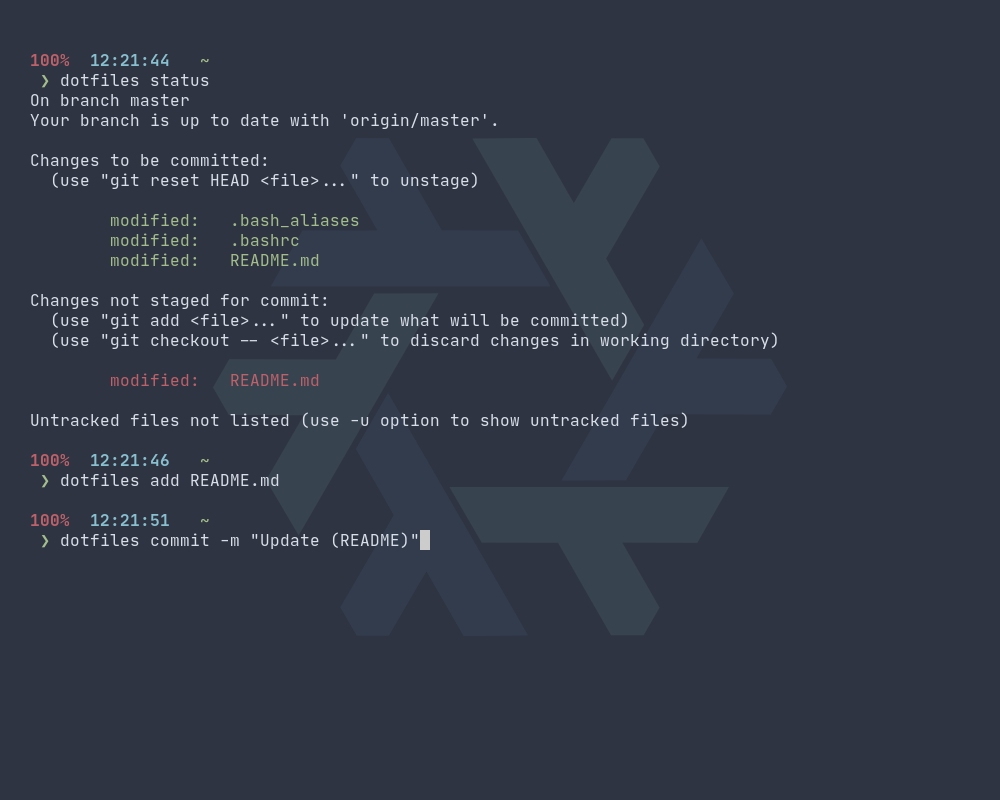

# Wabri's Dotfiles

A total nord dotfiles.

## Bash

I use [bash-it framework](https://github.com/Bash-it/bash-it) with some patches I made and one new theme created by me:

* [.bashrc](.bashrc)
* [.bash_aliases](.bash_aliases)
* [.bash_it/themes/wabri/wabri.theme.bash](.bash_it/themes/wabri/wabri.theme.bash)

### Bashrc

Some mentions on this configuration:

* Vim motion abilitate:

    ```Bash
    set -o vi
    ```
    
* The must have ignore case abilitate:

    ```Bash
    bind 'set completion-ignore-case on'
    ```

* Some history settings and more (if you are curious there are many comments on the script)

### Bash aliases

Mine aliases are:

* Replace the old **ls,ll and la** with [exa](https://the.exa.website/):


* Created some **cd** aliases:


* Shortcuts for **apt**:


* Alias for [thefuck](https://github.com/nvbn/thefuck):


* Dotfiles command to update this repo ([How I maintain those dotfiles](#how-i-maintain-those-dotfiles)):



There are a lot of aliases that you can find also on the general aliases of [bash-it](https://github.com/Bash-it/bash-it).

## Why nord

I'm using the [nord colorscheme](https://www.nordtheme.com/) because is a perfect balance between dark and light. Don't judge me I love dark themes, but there is something missing in using a total dark theme.
I remember when the first time I riced I spent over a month by changing the palette to find a list of colors that fits, thanks to [mycolor.space](https://mycolor.space/) that helped me a lot.
One day [one of my friend](https://github.com/w00zie) told me that he started using a colorscheme called nord and after some screenshot I decided to try it.
Now I'm using nord everywhere I can, from vim to telegram and I'm well settled.

## How I maintain those dotfiles

I created a .dotfiles directory on my home and init a bare repository on it:

```Bash
mkdir ~/.dotfiles
git init --bare ~/.dotfiles
```

I defined an alias:

```bash
alias dotfiles='git --git-dir=$HOME/.dotfiles --work-tree=$HOME'
```

I set the remote:

```Bash
dotfiles remote add origin git@github.com:Wabri/dotfiles.git
```

And now I can update my dotfiles wherever I am and whenever I want, by simply use the git command, example:

```Bash
dotfiles add .bashrc
dotfiles commit -m "Update (bashrc)"
dotfiles push 
```

Atlassian made a tutorial about this method, you can find the post here [**The best way to store your dotfiles: A bare Git repository**](https://www.atlassian.com/git/tutorials/dotfiles).

