# Wabri's Dotfiles

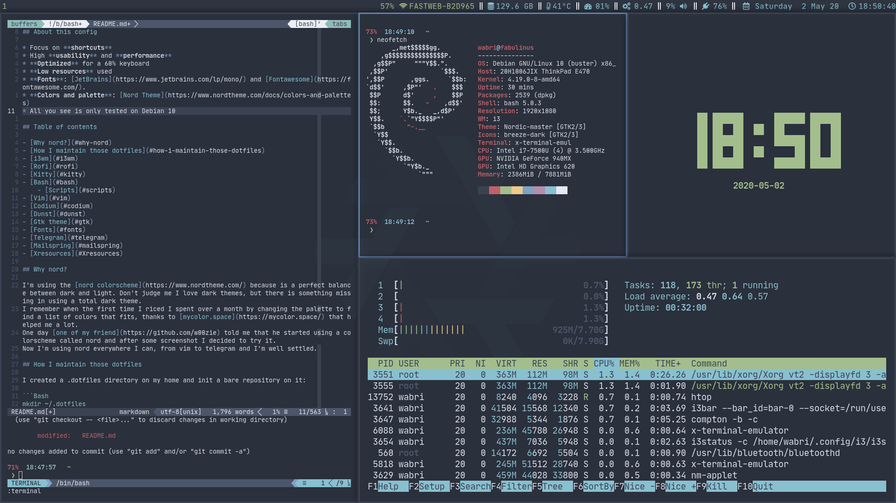

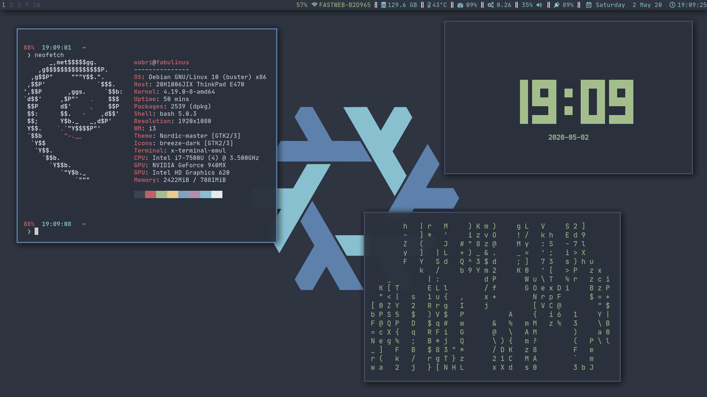


## About this config

* Focus on **shortcuts**
* High **usability** and **performance**
* **Optimized** for a 60% keyboard
* **Low resources** used
* **Fonts**: [JetBrains](https://www.jetbrains.com/lp/mono/) and [Fontawesome](https://fontawesome.com/).
* **Colors and palette**: [Nord Theme](https://www.nordtheme.com/docs/colors-and-palettes)
* All you see is only tested on Debian 10

## Table of contents

- [Why nord?](#why-nord)
- [How I maintain those dotfiles](#how-i-maintain-those-dotfiles)
- [i3wm](#i3wm)
- [Rofi](#rofi)
- [Kitty](#kitty)
- [Bash](#bash)
    - [Scripts](#scripts)
- [Vim](#vim)
- [Codium](#codium)
- [Dunst](#dunst)
- [Gtk theme](#gtk)
- [Fonts](#fonts)
- [Telegram](#telegram)
- [Mailspring](#mailspring)
- [Xresources](#Xresources)

## Why nord?

I'm using the [nord colorscheme](https://www.nordtheme.com/) because is a perfect balance between dark and light. Don't judge me I love dark themes, but there is something missing in using a total dark theme.
I remember when the first time I riced I spent over a month by changing the palette to find a list of colors that fits, thanks to [mycolor.space](https://mycolor.space/) that helped me a lot.
One day [one of my friend](https://github.com/w00zie) told me that he started using a colorscheme called nord and after some screenshot I decided to try it.
Now I'm using nord everywhere I can, from vim to telegram and I'm well settled.

## How I maintain those dotfiles

I created a .dotfiles directory on my home and init a bare repository on it:

```Bash
mkdir ~/.dotfiles
git init --bare ~/.dotfiles
```

I defined an alias:

```bash
alias dotfiles='git --git-dir=$HOME/.dotfiles --work-tree=$HOME'
```

I set the remote:

```Bash
dotfiles remote add origin git@github.com:Wabri/dotfiles.git
```

And now I can update my dotfiles wherever I am and whenever I want, by simply use the git command, example:

```Bash
dotfiles add .bashrc
dotfiles commit -m "Update (bashrc)"
dotfiles push 
```

Atlassian made a tutorial about this method, you can find the post here [**The best way to store your dotfiles: A bare Git repository**](https://www.atlassian.com/git/tutorials/dotfiles).

## I3wm

[.config/i3/config](.config/i3/config)

From 2017 I'm a [i3wm](https://i3wm.org/) user, I created and tested many configuration focus on dark theme and ricing, here is my [old dotfiles](https://github.com/wabri/old_dotfiles).

I try to use less resources and keep it as light as possible and this is what it look like on idle:

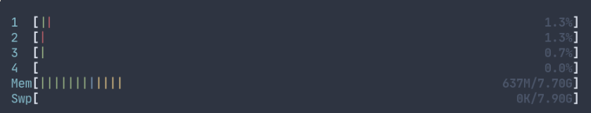

There are deamons and applets running: 

- compton a compositor
- network manager applet
- blueman applet for bluethoot managing
- dunst for notifications

### Theme

This is the palette for the container:

| Class | Border | Background | Text | Indicator | Child_border |
| ----------------------- | ------- | ------- | ------- | ------- | ------- |
| client.focused          | #4C566A | #4C566A | #A3BE8C | #EBCB8B | #5E81AC |
| client.focused_inactive | #2E3440 | #B48EAD | #A3BE8C | #8FBCBB | #434C5E |
| client.unfocused        | #2E3440 | #3B4252 | #8FBCBB | #8FBCBB | #3B4252 |
| client.urgent           | #BF616A | #BF616A | #2E3440 | #BF616A | #BF616A |
| client.placeholder      | #88C0D0 | #2E3440 | #B48EAD | #2E3440 | #2E3440 |
| client.background       | #D8DEE9 |         |         |         |         |

### Lock

**$mod+Shift+x**

I replace the old `i3exit lock` lock screen:

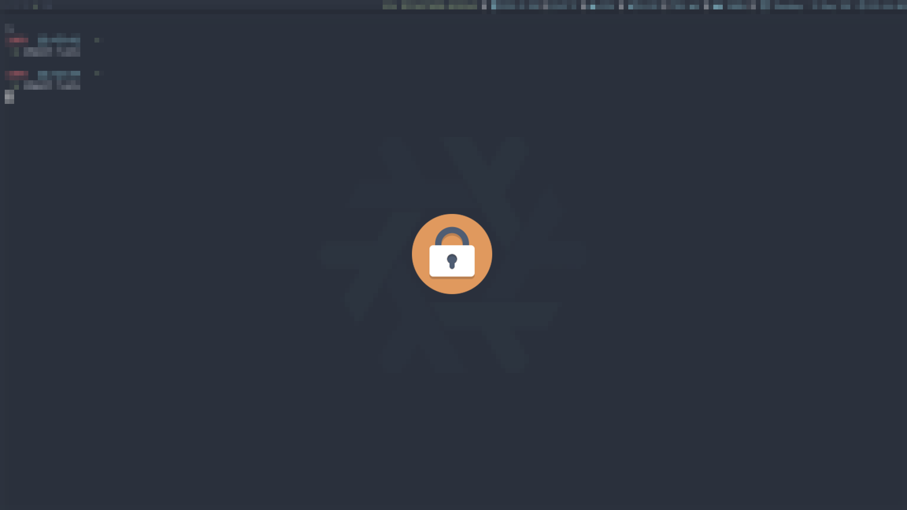

With the `i3lock-fancy`:

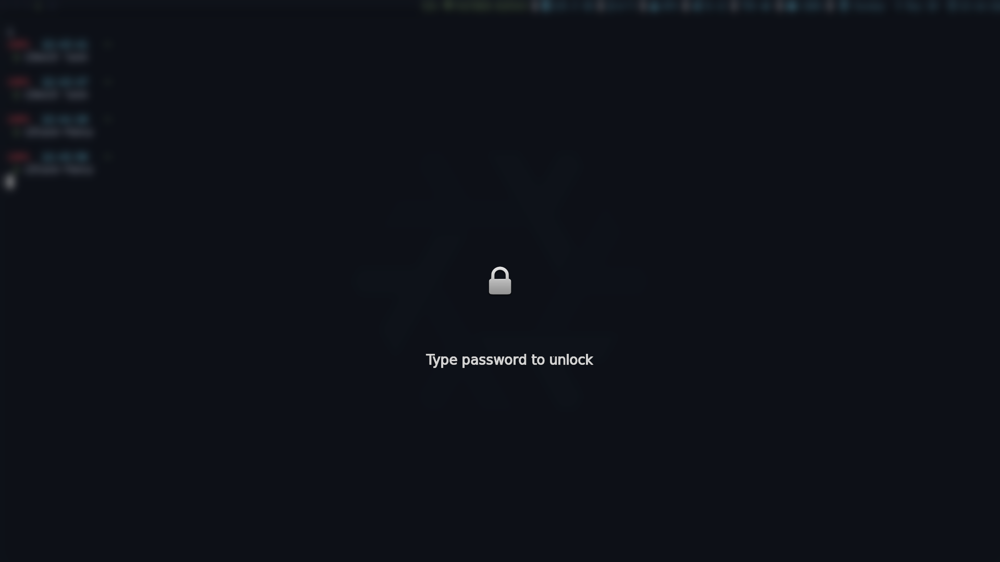

### System controll

**$mod+Escape**

I also use the [system-controll](#system-controll) for more accessibility:

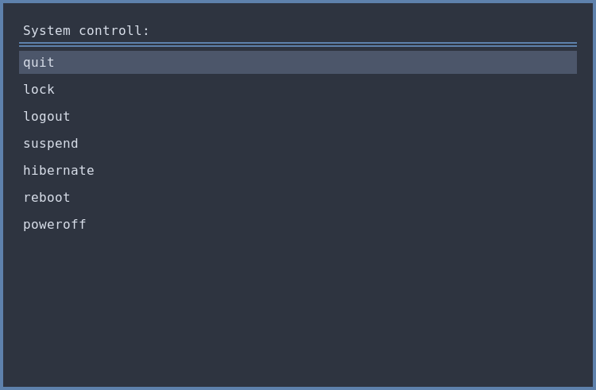

### Applications launcher & windows switcher

**$mod+Shift+Return**

I use the rofi lancher with [personal theme](#rofi):

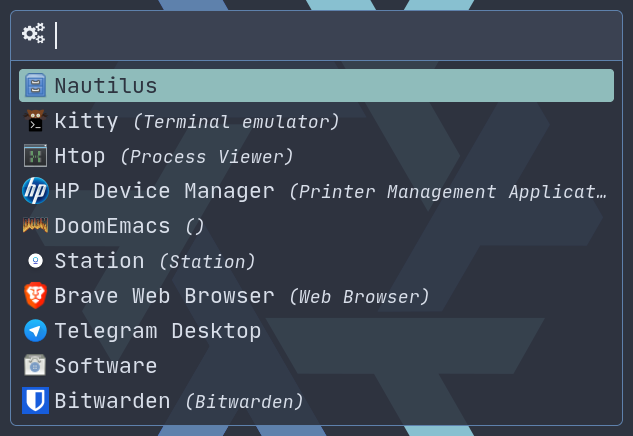

**$mod+Tab**

When there are too many windows open is necessary to have a list:

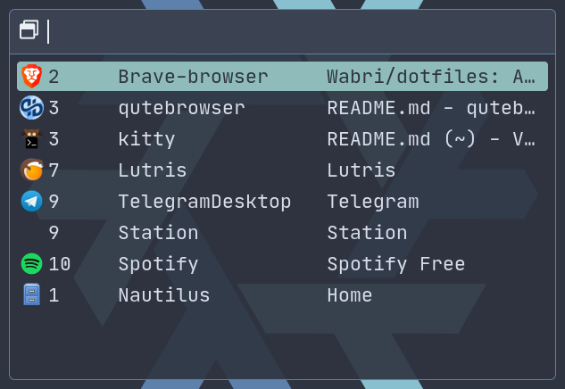

### Wallpaper


I use nitrogen to manage wallpaper:

```I3config
exec nitrogen --restore
```

### Modes

I create several modes to improove usability:

- [system](#system) -> shortcut for [i3exit script](#i3exit)
- [resize](#resize) -> resize windows and containers
- [spotato](#spotato) -> media controll 
- [workspace](#workspace) -> move window between outputs

#### System

**$mod+p** is the bindsym to enter in this mode:

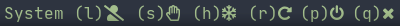

- l -> logout
- s -> suspend
- h -> hibernate
- r -> reboot
- p -> shutdown
- q -> return in default mode

#### Resize

**$mod+r** is the bindsym to enter in this mode:

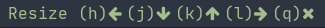

- h -> resize left 
- j -> resize down
- k -> resize up
- l -> resize right
- q -> return in default mode

#### Spotato

**$mod+s** is the bindsym to enter in this mode:


- h -> previous song
- l -> next song
- j -> pause song
- k -> play song
- s -> toggle play/pause song
- a -> volume down
- d -> volume up
- q -> return in default mode

#### Workspace

**$mod+Shift+Tab** is the bindsym to enter in this mode:


- h -> Move workspace to output left
- j -> Move workspace to output down
- k -> Move workspace to output up
- l -> Move workspace to output right
- q -> return in default mode

## i3Status

[.config/i3/i3status.conf](.config/i3/i3status.conf)

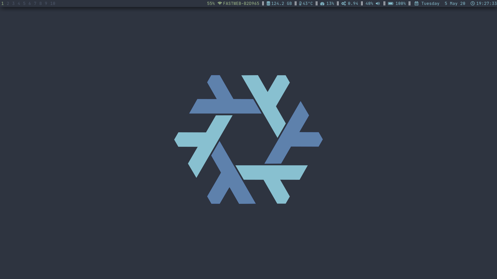

## Rofi

[.config/rofi/config](.config/rofi/config)

I use [Rofi](https://github.com/davatorium/rofi) for applications launcher and in some i3 scripts.

I create a personal nord theme:


The theme is possible to find on [.local/share/rofi/themes/nord.config](.local/share/rofi/themes/nord.config).

## Kitty

- [kitty.conf](.config/kitty/kitty.conf)
- [nord.conf](.config/kitty/nord.conf)

The page of the [kitty site](https://sw.kovidgoyal.net/kitty/) said: the fast, featureful, GPU based terminal emulator. Fast is fast for now, I confirm the featureful and I presume it use the GPU.

I love to use the [JetBrains](https://www.jetbrains.com/lp/mono/) font for the lignatures, the letters and the semplicity of the shapes:

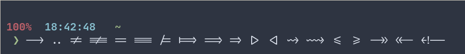

I found useful the build-in tabs and windows feature:

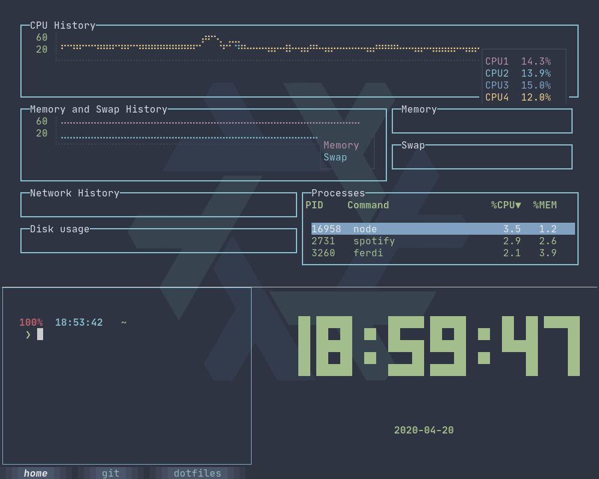

Then I create some personal shortcuts using the alt as kitty modifier:

| --- | Description |
| - | - |
| ctrl+shift+c | copy |
| ctrl+shift+v | paste |
| kitty_mod+u | hints urls |
| kitty_mod+enter | new window |
| kitty_mod+r | resizing window |
| kitty_mod+] | move to next window |
| kitty_mod+[ | move to previous window |
| kitty_mod+k | move window to top |
| kitty_mod+t | new tab |
| kitty_mod+w | close tab |
| kitty_mod+i | set tab title |
| kitty_mod+l | next tab |
| kitty_mod+h | previous tab |
| kitty_mod+shift+L | move tab forward |
| kitty_mod+shift+H | move tab backward |
| kitty_mod+1 | go to tab 1 |
| kitty_mod+2 | go to tab 2 |
| kitty_mod+3 | go to tab 3 |
| kitty_mod+4 | go to tab 4 |
| kitty_mod+5 | go to tab 5 |
| kitty_mod+shift+E | edit config file |
| kitty_mod+shift+U | unicode input |

The nord palette of kitty can be found in the [same directory of the kitty config](.config/kitty/).

## Bash

- [.bashrc](.bashrc)
- [.bash_aliases](.bash_aliases)
- [wabri.theme.bash](.bash_it/themes/wabri/wabri.theme.bash)

I use [bash-it framework](https://github.com/Bash-it/bash-it) with some patches I made and one new theme created by me.

### Bashrc

Some mentions on this configuration:

* Vim motion abilitate:

    ```Bash
    set -o vi
    ```
    
* The must have ignore case abilitate:

    ```Bash
    bind 'set completion-ignore-case on'
    ```

* Some history settings and more (if you are curious there are many comments on the script)

### Bash aliases

Mine aliases are:

* Replace the old **ls,ll and la** with [exa](https://the.exa.website/):

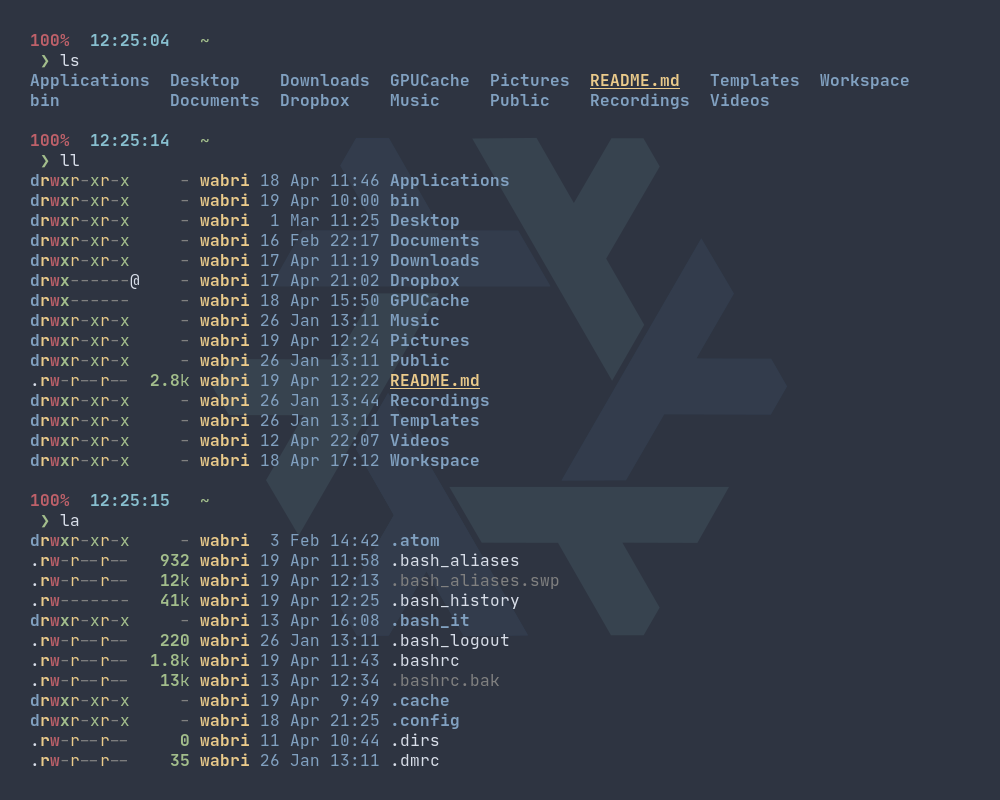

* Created some **cd** aliases:

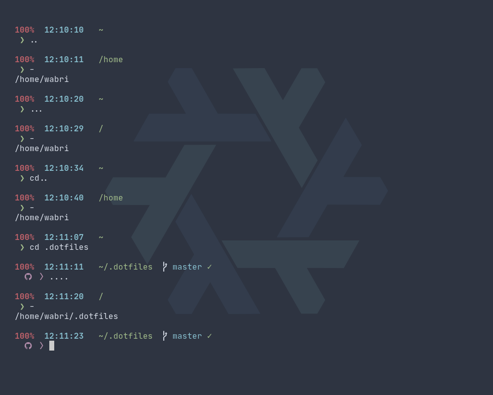

* Shortcuts for **apt**:

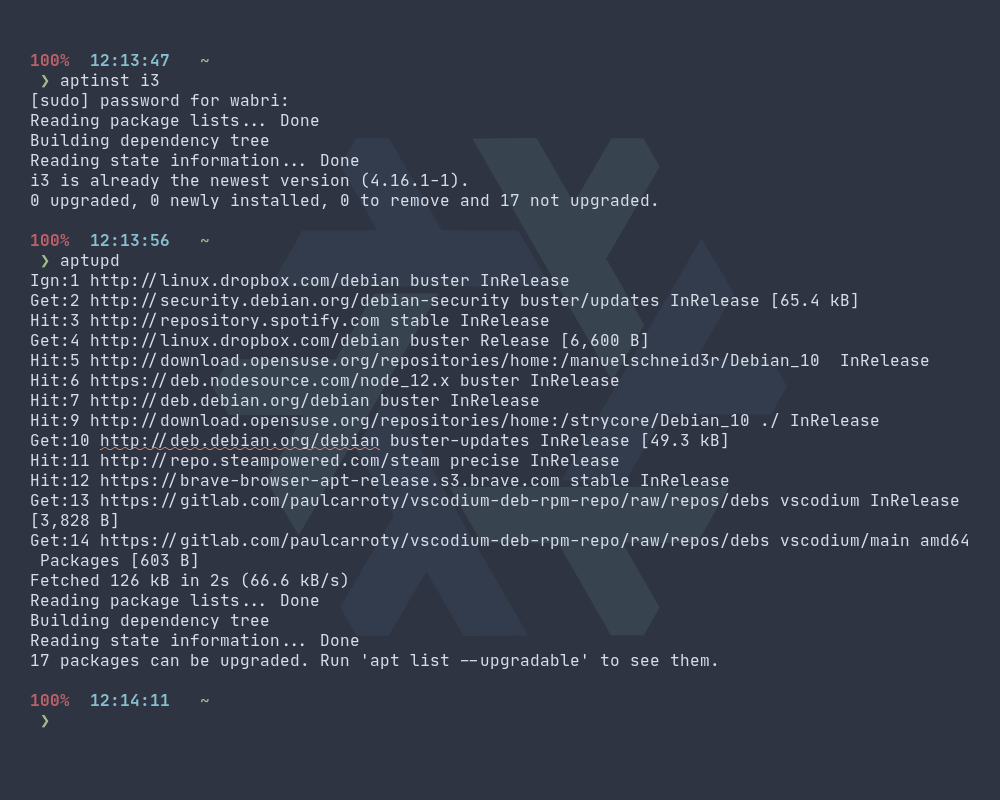

* Alias for [thefuck](https://github.com/nvbn/thefuck):

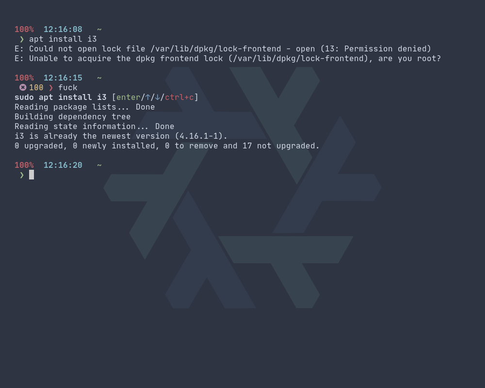

* Dotfiles command to update this repo ([How I maintain those dotfiles](#how-i-maintain-those-dotfiles)):

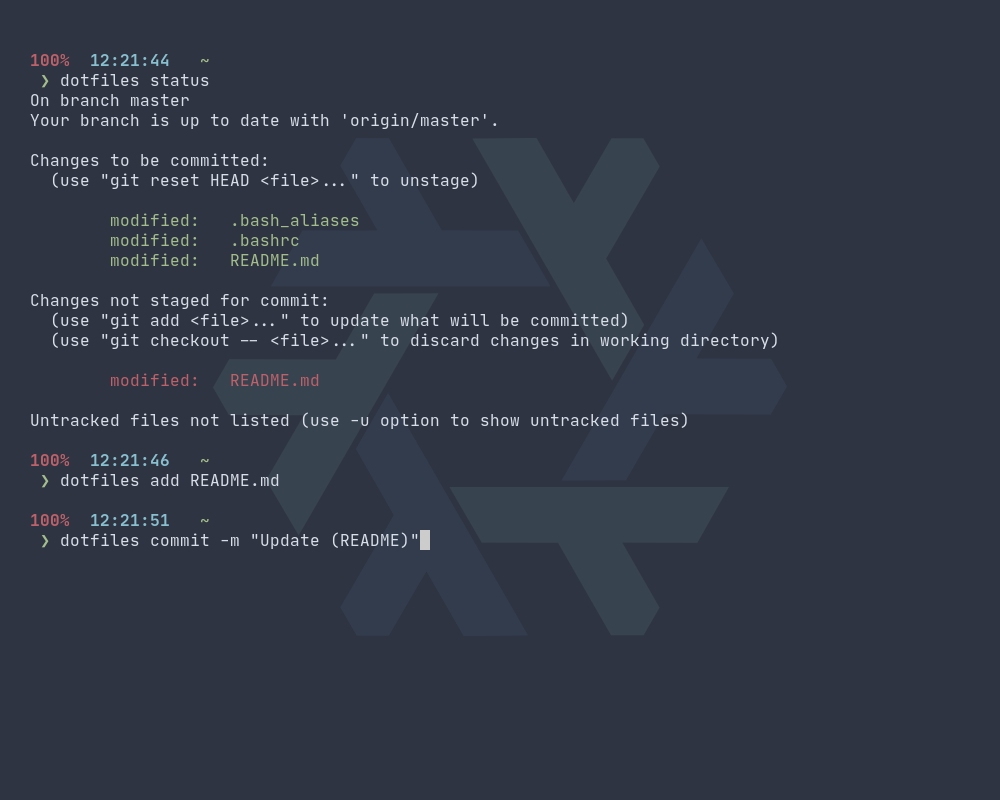

There are a lot of aliases that you can find also on the general aliases of [bash-it](https://github.com/Bash-it/bash-it).

### Scripts

Overtime I create a lot of scripts:

| Script | Description |
| ------ | ----------- |
| [chkey](#chkey) | Change keyboard layout |
| [editors](#editors) | Choose text editor to open |
| [dtest](#dtest) | Run tests for dunst notifications |
| [configs](#configs) | Choose what config need to edit |
| [extract](#extract) | Extract everything |
| [i3exit](#i3exit) | Systmctl for human |
| [i3light](#i3light) | Brightness controll for humans |
| [i3media](i3media) | Controll media with command line |
| [system-controll](#system-controll) | Systmctl menu |
| [vimv](#vimv) | Batch-rename files using Vim -- [thameera/vimv](https://github.com/thameera/vimv) |
| [compilepreview](#compilepreview) | Compile a text from different format to a readable one |
| [openpreview](#openpreview) | Open file created with [compilepreview](#compilepreview) |

#### Chkey

***[.local/bin/chkey](.local/bin/chkey)***

The script switch over 2 keyboard Italian and Us, can work over more keyboard by adding a new use case.

The content of the case is this:

```Bash
setxkbmap -v | awk -F '+' '/symbols/ {print $2}'
```

from the output of the setxkbmap -v, that is something like this:

```Text
Trying to build keymap using the following components:
keycodes:   evdev+aliases(qwerty)
types:      complete
compat:     complete
symbols:    pc+us+inet(evdev)
geometry:   pc(pc105)
```

On the line where there is **symbols** split when find the + simbol and return the second component, in this case will be the keyboard layout. This result is passed for the cases and if the layout is us than switch to it and viceversa.

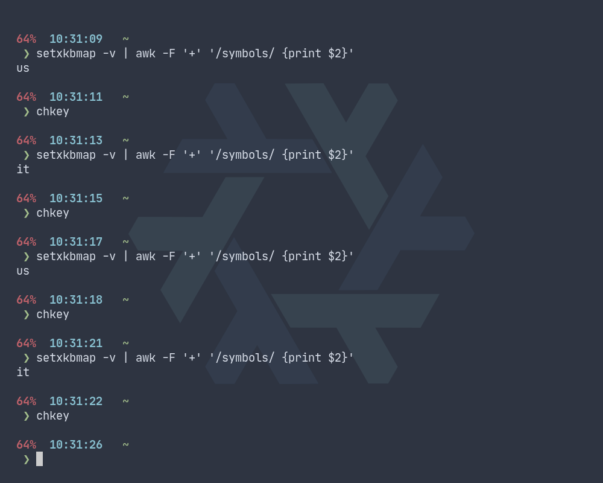

#### Editors

***[.local/bin/editors](.local/bin/editors)***

This is one of the menu used with i3 (I binded with mod+f3):

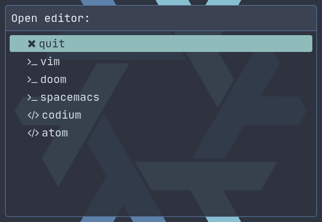

#### Dtest

***[.local/bin/dtest](.local/bin/dtest)***

Simply restart the dunst session, used to debug dunst configuration:

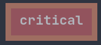
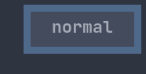


#### Configs

***[.local/bin/configs](.local/bin/configs)***

Same functionality of [editors](#editors), but choose from configurations.

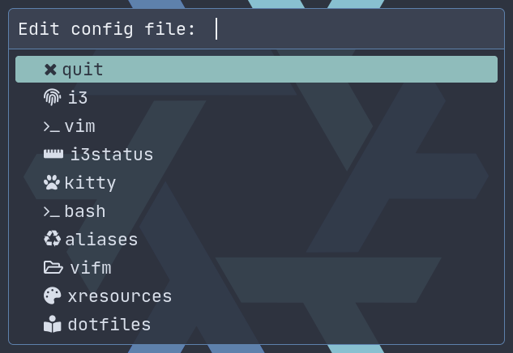

#### Extract

***[.local/bin/extract](.local/bin/extract)***

For now works with:

- tar.bz2
- tar.gz 
- bz2
- rar
- gz
- tar
- tbz2
- tgz
- zip
- Z
- 7z

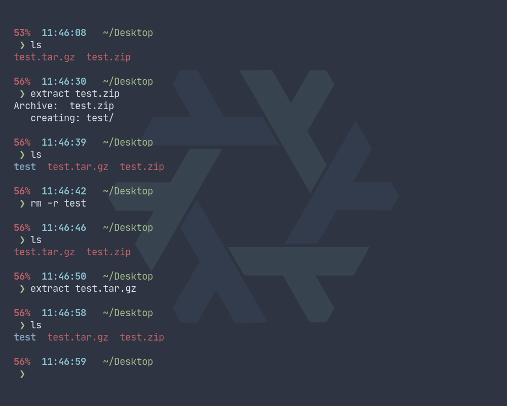

#### i3exit

***[.local/bin/i3exit](.local/bin/i3exit)***
***Used on i3 config***

A command line utility with a better use of systmctl:

```Bash
i3exit {lock|logout|suspend|hibernate|reboot|shutdown}
```

#### i3light

***[.local/bin/i3light](.local/bin/i3light)***
***Used on i3 config***

A command line utility to manage brightness:

```Bash
i3light {up|down}
```

There is a dependency to install in order to use it:

- [haikarainen/light](https://github.com/haikarainen/light)
- notify-send found on the official repository as libnotify
- notification deamon like [dunst](https://github.com/dunst-project/dunst)

#### i3media

***[.local/bin/i3media](.local/bin/i3media)***
***Used on i3 config***

A command line utility to manage media:

```Bash
i3media {vol_up|vol_down|vol_toggle|mic_toggle}
```

There is a dependency to install in order to use it:

- amixer found on the official repository as alsa-tools
- notify-send found on the official repository as libnotify
- notification deamon like [dunst](https://github.com/dunst-project/dunst)

#### System-controll

***[.local/bin/system-controll](.local/bin/system-controll)***

Same functionality of [editors](#editors), but choose from system controll.


#### Vimv

Batch-rename files using Vim ([github repository](https://github.com/thameera/vimv)).

#### Compilepreview

***[.local/bin/compilepreview](.local/bin/compilepreview)***

Used on vim to create a preview file.

#### Openpreview

***[.local/bin/openpreview](.local/bin/openpreview)***

Used on vim to open a preview file created with [compilepreview](.local/bin/compilepreview).

## Vim

[.vimrc](.vimrc)

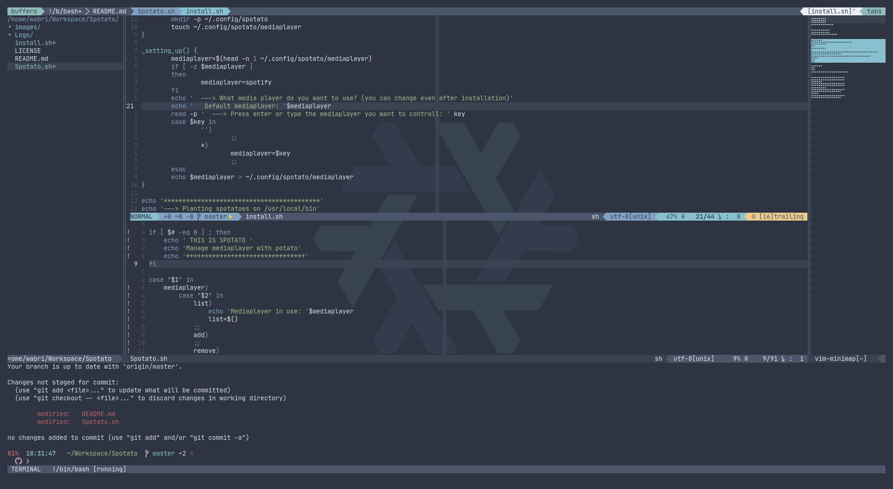

I use vim as my main text editor for coding and writing. I use severl plugins:

- Themes:
    - Colorscheme -> [arcticicestudio/nord-vim](https://github.com/arcticicestudio/nord-vim)
    - Status & Tabline -> [vim-airline/vim-airline'](https://github.com/vim-airline/vim-airline)
- Utils:
    - Start screen -> [mhinz/vim-startify](https://github.com/mhinz/vim-startify)
    - Distraction free writing -> [junegunn/goyo.vim](https://github.com/junegunn/goyo.vim)
    - Tree explorer -> [preservim/nerdtree](https://github.com/preservim/nerdtree)
    - File picker -> [vifm/vifm.vim](https://github.com/vifm/vifm.vim)
    - Minimap -> [severin-lemaignan/vim-minimap](https://github.com/severin-lemaignan/vim-minimap)
    - Buffers and more -> [vim-ctrlspace/vim-ctrlspace](https://github.com/vim-ctrlspace/vim-ctrlspace)
    - Markdown preview -> [iamcco/markdown-preview.vim](https://github.com/iamcco/markdown-preview.vim)
- Git:
    - [tpope/vim-fugitive](https://github.com/tpope/vim-fugitive)
    - [mhinz/vim-signify](https://github.com/mhinz/vim-signify)
- Syntax:
    - [PotatoesMaster/i3-vim-syntax](https://github.com/PotatoesMaster/i3-vim-syntax)

I create some shortcuts using the space mapleader:

- Save and quit

    ```Vimrc
    nmap <leader>w :w!<cr>
    nmap <leader>W :wq<cr>
    nmap <leader>q :q<cr>
    nmap <leader>Q :q!<cr>
    ```

- Select all

    ```Vimrc
    nnoremap <leader>a ggVG
    ```

- Terminal

    ```Vimrc
    nnoremap <leader>t :terminal<CR>
    ```

- Copy and paste

    ```Vimrc
    nnoremap <leader>p :set paste<CR>"+p:set nopaste<CR>
    vnoremap <leader>p <Esc>:set paste<CR>gv"+p:set nopaste<CR>
    
    vnoremap <leader>y "+y
    ```

- NerdTree toggle

    ```Vimrc
    " Shortcut
    map <leader>e :NERDTreeToggle<CR>
    ```

- Startify open

    ```Vimrc
    nmap <leader><leader> :Startify<CR>
    ```

- Git

    ```Vimrc
    nmap <leader>gs :Gstatus<CR>
    nmap <leader>gc :Gcommit<CR>
    nmap <leader>gl :GlLog<CR>
    ```

- Distraction free toggle

    ```Vimrc
    map <leader>f :Goyo \| set linebreak<CR>
    ```
- Buffers

    ```Vimrc
    nnoremap <leader>bn :bnext<CR>
    nnoremap <leader>bp :bprev<CR>
    nnoremap <leader>bb :CtrlSpace<CR>
    ```

- Minimap

    ```Vimrc
    let g:minimap_toggle='<leader>mm'
    let g:minimap_show='<leader>ms'
    let g:minimap_update='<leader>mu'
    let g:minimap_close='<leader>mc'
    let g:minimap_highlight='Search'
    ```

- Vifm

    ```Vimrc
    map <Leader>v :Vifm<CR>
    ```

- Preview (see [compilepreview](#compilepreview) and [openpreview](#openpreview)

    ```Vimrc
    map <leader>cm <Plug>MarkdownPreview
    map <leader>cs <Plug>MarkdownPreviewStop
    map <leader>cc :w! \| !compilepreview <c-r>%<CR>
    map <leader>co :!openpreview <c-r>%<CR><CR>
    ```

### Startup

If vim is start without any argument the empty buffer is replaced with NerdTree and Startify:

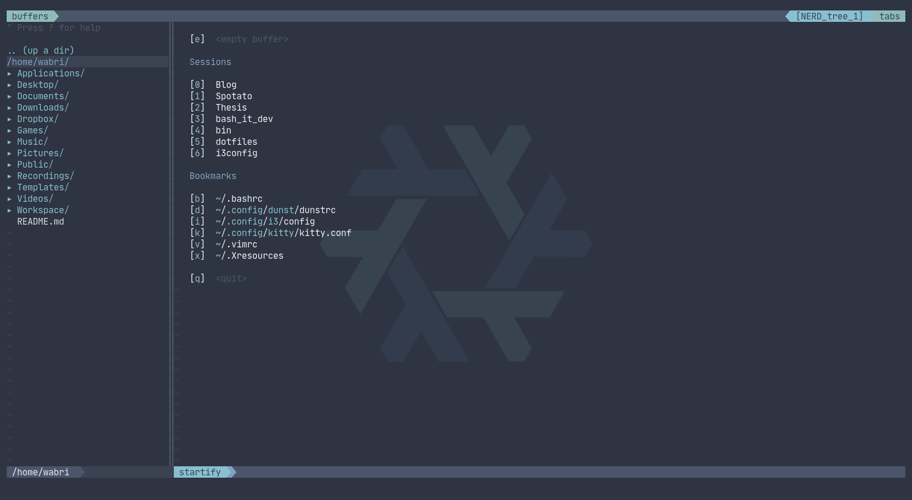

### Minimap

I use the minimap when I need to edit a large file or a long documentation:

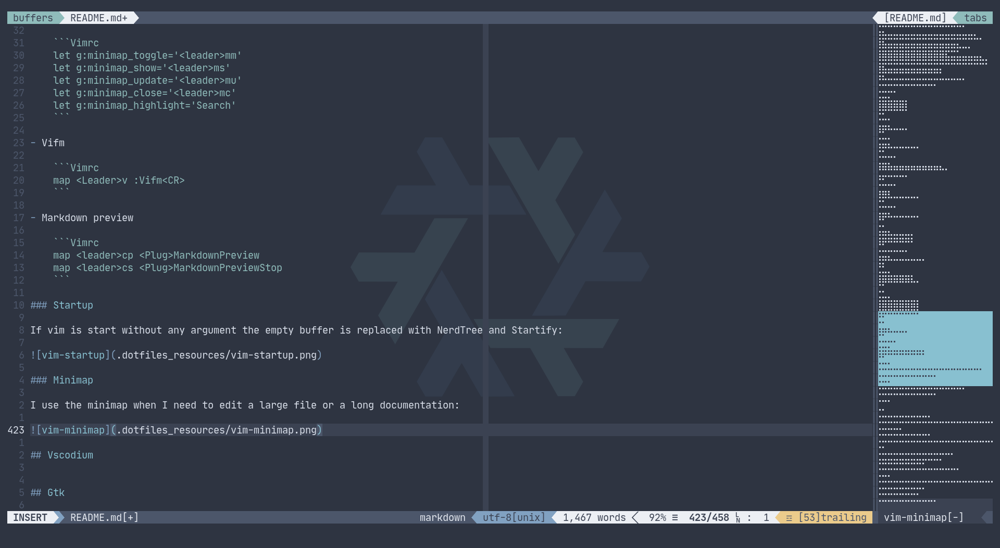

### Preview

When I edit a Markdown file is necessary to have a visual feedback:

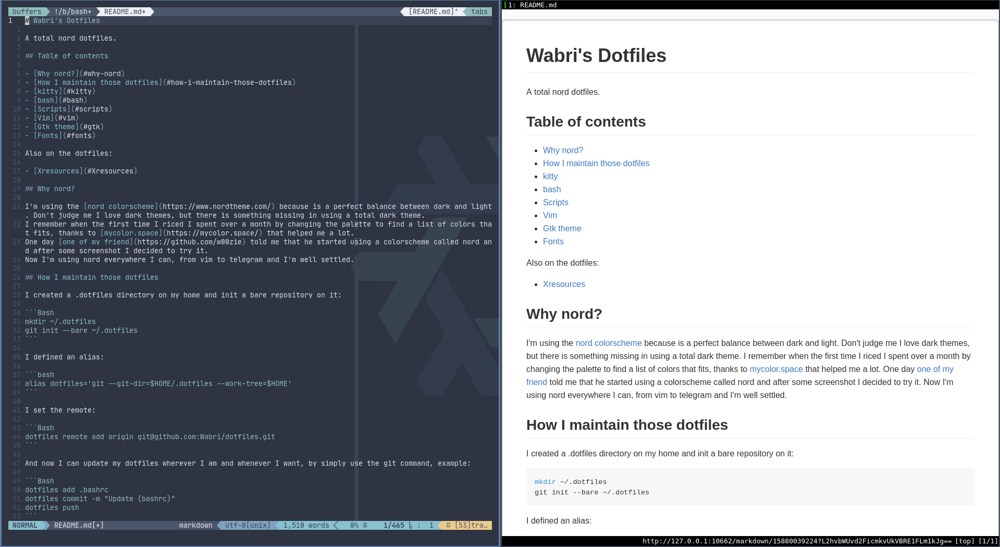

I prefer to use [qutebrowser](https://qutebrowser.org/) for the preview because is more light than other browsers and have the build-in vim key to move on the page.

Latex file are preview with the [compilepreview](#compilepreview) that create a pdf fileand the [openpreview](#openpreview) open it with the zathura pdf reader.

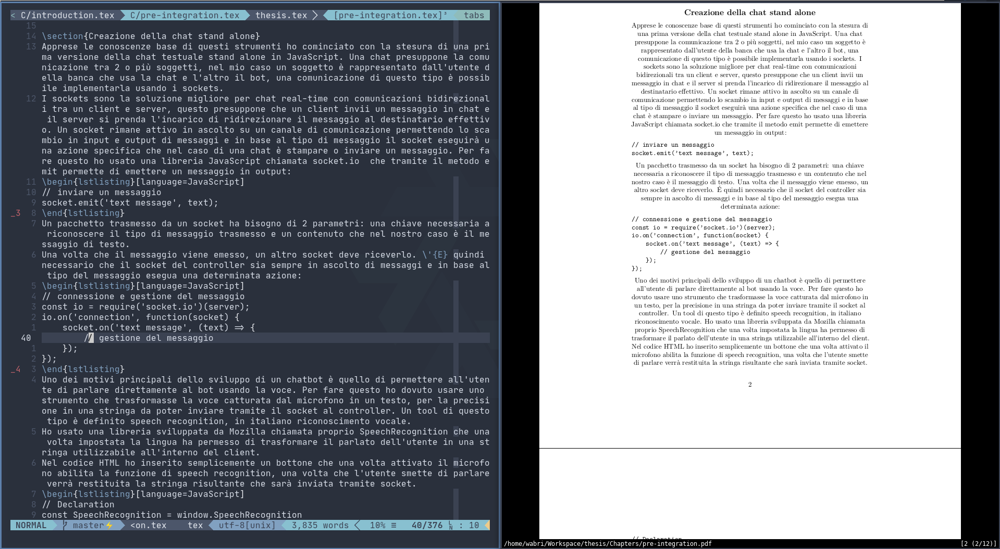

### Distraction free mode

When I want to concentrate I need to focus only where I write, this is why use a distraction free mode:

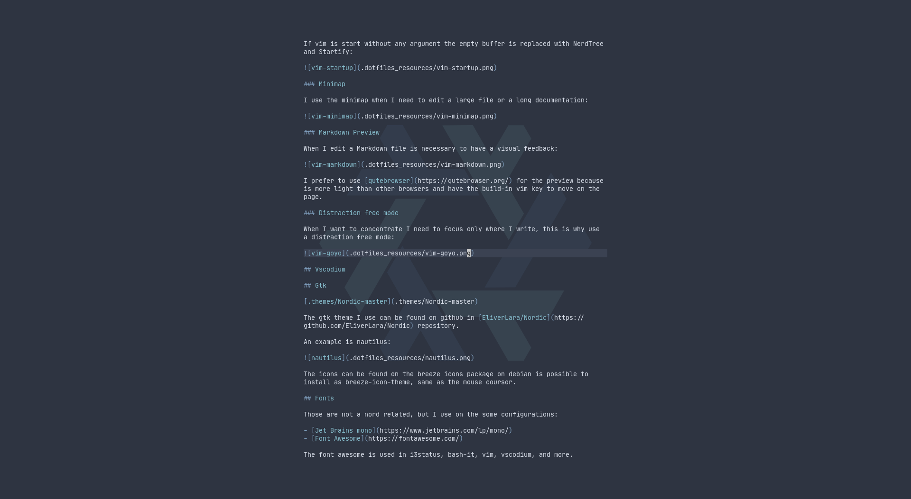

## Codium

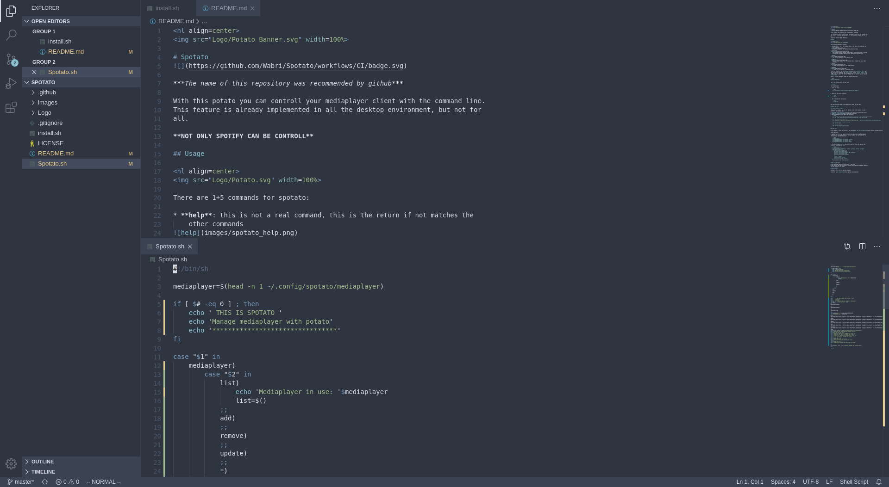

List of plugins:

- Use vim on Codium [VSCodeVim/Vim](https://github.com/VSCodeVim/Vim)
- Nord theme [arcticicestudio/nord-visual-studio-code](https://github.com/arcticicestudio/nord-visual-studio-code)
- Python code [Microsoft/vscode-python](https://github.com/Microsoft/vscode-python)
- Markdown preview and more [yzhang-gh/vscode-markdown](https://github.com/yzhang-gh/vscode-markdown)

## Dunst

[.config/dunst/dunstrc](.config/dunst/dunstrc)

I manage to create a nord theme dunst notifications:

- low

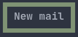

- normal

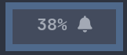

- high

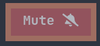

I heavly use notifications with [i3 configuration](.config/i3/config) and with i3 related scripts like [i3ligh](.local/bin/i3ligh) and [i3media](.local/bin/i3media).

I create some shortcut:

- Close notification -> mod4+shift+z

- Close all notifications -> mod4+shift+z

- Show history -> mod4+n 

## Gtk

[.themes/Nordic-master](.themes/Nordic-master)

The gtk theme I use can be found on github in [EliverLara/Nordic](https://github.com/EliverLara/Nordic) repository.

An example is nautilus:

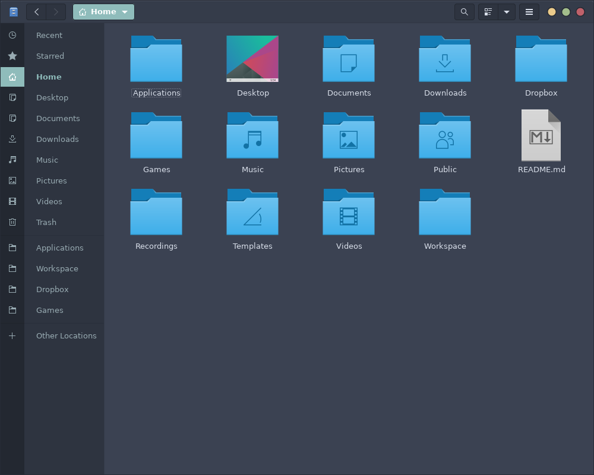

The icons can be found on the breeze icons package on debian is possible to install as breeze-icon-theme, same as the mouse coursor.

## Fonts

Those are not a nord related, but I use on the some configurations:

- [Jet Brains mono](https://www.jetbrains.com/lp/mono/)
- [Font Awesome](https://fontawesome.com/)

The font awesome is used in i3status, bash-it, vim, vscodium, and more.

## Telegram

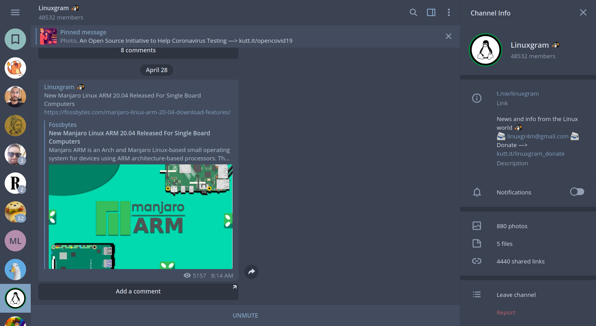

To install this theme visit the [gilbertw1/telegram-nord-theme](https://github.com/gilbertw1/telegram-nord-theme) and follow the docs.

## Mailspring


To install this theme visit the [faraadi/mailspring-nord-theme](https://github.com/faraadi/mailspring-nord-theme) and follow the docs.

## Xresources

In my old setup I use the urxvt terminal emulator (on debian can be found as *rxvt-unicode-256color*), but when setting up and let it work properly is a very hard and tedious work so I switch over [kitty terminal](#kitty).

The visual impression is similar to kitty:

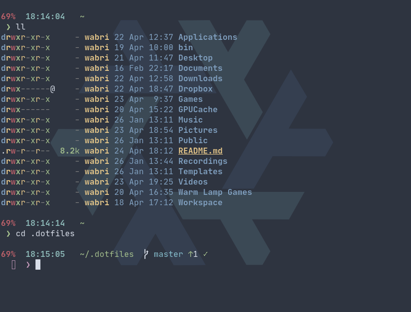

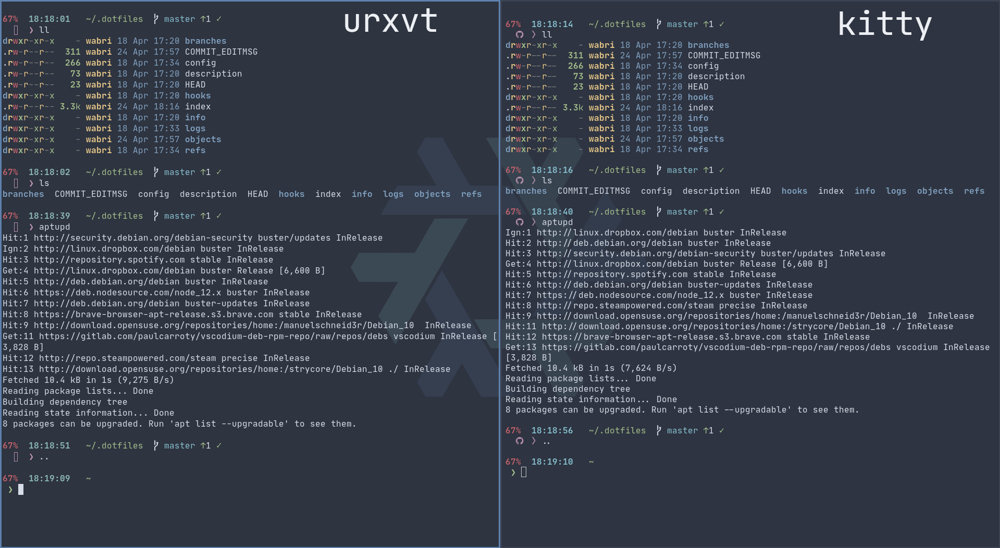

